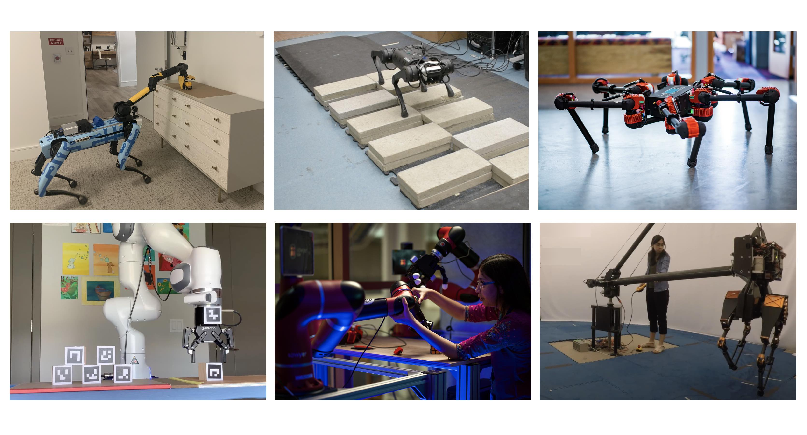

# Akshara Rai

I am a research scientist at [Meta AI][Meta AI] in Menlo Park, working on robot learning. My research focuses on sample-efficient learning in robotics, through the use of prior knowledge from simulators, domain expertise. and optimal control. One of my greatest joys is to see my robots do something they couldn't do before (which is a lot of things). Here are some of the robots I have worked with.

To get in touch with me, feel free to drop me an email at 			
. 
Check out my publications at my [Google Scholar][Google Scholar] profile. I don't have a Twitter account, but you can watch this [Humans of AI][HAI] episode to learn more about me.

[Meta AI]: https://ai.facebook.com/
[Google Scholar]: https://scholar.google.com/citations?user=H8FJlJoAAAAJ&hl=en
[HAI]: https://youtu.be/JW4pcRX6biY
